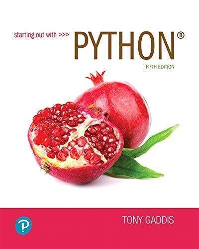

# Starting Out with Python 5th Edition by Tony Gaddis

---

     

---

## Introduction
Hi! This is my first Git repository, and it contains solutions to all the exercises from book: **Tony Gaddis "Starting Out With Python"**.

## Description

All exercises are organized by chapters and sections of the book.  
The solutions are written with a focus on simplicity and alignment with the book's material.

Project goals:
- To demonstrate the material learned in Python.
- To assist other students in learning Python.
- To systematize and showcase my own solutions.

## Contacts

If you have any questions or suggestions, feel free to reach out:

Email: <lenkova050@gmail.com>  
GitHub: tema.vice

Thank you.
